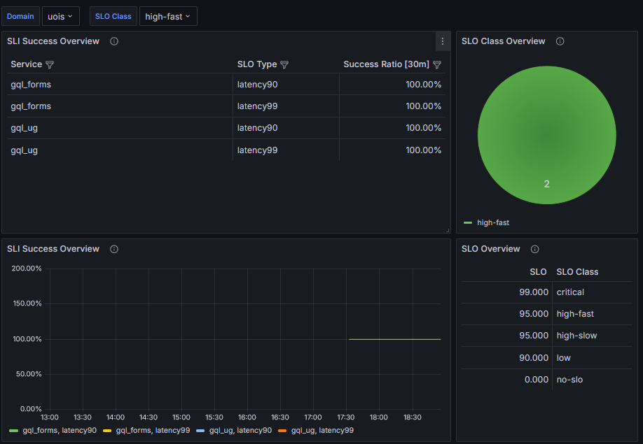

# SIEM

Setup:
- gql_ug - [link](https://github.com/r0zehnal0vak/gql_ug/tree/SIEM)
- gql_forms - [link](https://github.com/r0zehnal0vak/gql_forms/tree/SIEM)

```
# build gql_ug image
$ docker build . -t hrbolek/gql_ug

#build gql_forms image
$ docker build . -t hrbolek/gql_forms

# compose _uois
$ docker compose up
```
Curl the metrics inside gql_ug container:
```
$ curl http://gql_ug:8080/metrics | grep apollo_gql_processing_seconds
$ curl http://gql_forms:8080/metrics | grep apollo_gql_processing_seconds
$ curl http://slo_exporter:8080/metrics | grep apollo_gql_processing_seconds
```

In GraphiQL you can run these example queries and then curl the metrics to see the results:
- for gql_ug:
```
query MyQuery2 {
  userPage {
    __typename
    name
    email
    id
    surname
    valid
    fullname
    created
    lastchange
    memberships {
      created
      enddate
      id
      lastchange
      startdate
      valid
      group {
        created
        email
        name
        nameEn
      }
      user {
        name
        id
        fullname
        email
        valid
        surname
      }
    }
    answers {
      aswered
      created
      expired
      lastchange
      value
    }
  }
}
```
- for gql_forms:
```
query MyQuery {
  formPage {
    created
    id
    lastchange
    name
    nameEn
    status
    valid
  }
}
```

Query for both gql_ug and gql_forms:
```
query MyQuery {
  formPage {
    created
    id
    lastchange
    name
    nameEn
    valid
    status
    rbacobject {
      roles {
        group {
          abbreviation
          created
          email
          lastchange
          id
          valid
          nameEn
          name
        }
        created
        enddate
      }
      id
    }
  }
}
```

## SIEM our part - documentation
This project is based on [link](https://github.com/Joseph-Beppe/_uois/tree/downstream).
- __Setup for docker-compose.yaml__: We made specific changes to the <code>docker-compose.yaml</code> file to enhance the monitoring setup. These changes involve modifying the configurations for Prometheus and Grafana and adding a new configuration for the SLO Exporter.
- __Adding scrape targets__: We updated the <code>prometheus.yaml</code> configuration file to include additional targets for scraping metrics. This ensures Prometheus can monitor our specified services.
```
...
    static_configs:
      - targets: ['gql_ug:8080']
      - targets: ['gql_forms:8080']
      - targets: ['slo_exporter:8080']
...
```
 
- __Configuration to endpoints__:
  - __Exposing Metrics__: The metrics are exposed at the <code>/metrics</code> endpoint, allowing Prometheus to scrape them for monitoring purposes.
  - __Prometheus Metrics Setup__: The code sets up Prometheus metrics for monitoring purposes. It starts an HTTP server on port 8080 and configures Prometheus instrumentation for FastAPI using the <code>prometheus_fastapi_instrumentator</code> library.
  - __Histogram Definition__: The <code>APOLLO_GQL_HISTOGRAM</code> histogram is defined to measure the time spent processing Apollo GraphQL requests. This histogram provides insights into request processing times.
  - __Decorator Usage__: The <code>@APOLLO_GQL_HISTOGRAM.time()</code> decorator is applied to functions that handle Apollo GraphQL requests. This decorator measures the execution time of these functions and records it in the defined histogram.
- __Modifications to slo_exporter.yaml__: We made specific changes to the <code>slo_exporter.yaml</code> configuration file to include a custom query for monitoring the latency of GraphQL requests. By adding the <code>apollo_gql_processing_seconds_bucket</code> query, we enable the SLO Exporter to track and export relevant Service Level Objectives (SLOs) based on this query.
```
...
      - query: "apollo_gql_processing_seconds_bucket" 
        type: histogram_increase
        interval: 30s
        additionalLabels:
          event_type: request_latency
...
```

### Overview of functionality
Results of metrics after queries:
- running curl for gql_ug:
 

 - running curl for gql_forms:
 

Overview of Grafana dashboards after running queries:
- Class Overview
 
- Service Detail
 
